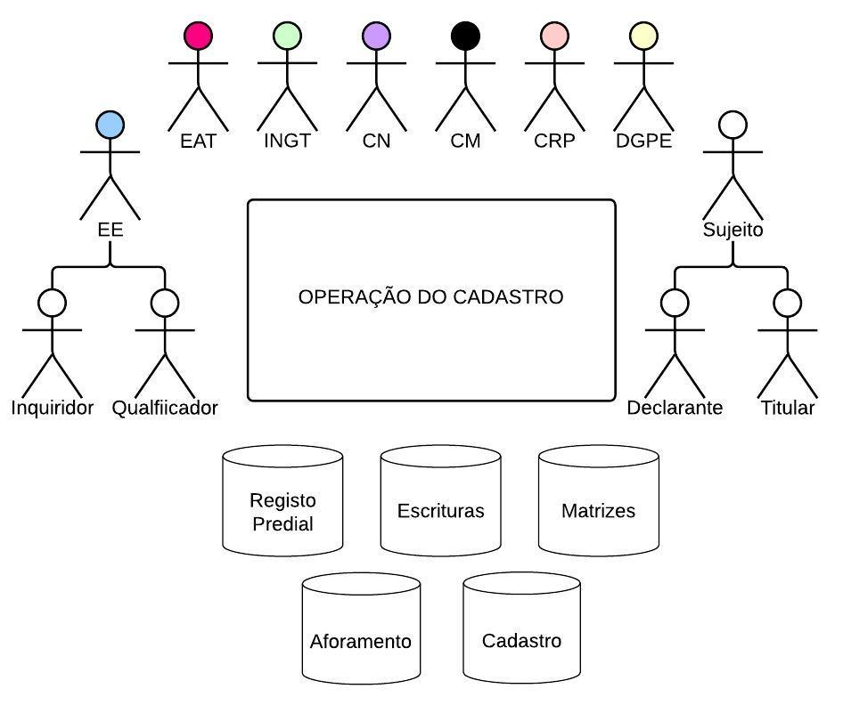

## Atores e responsabilidades {#atores-e-responsabilidades}

As operações do cadastro predial implicam vários atores, incluindo os que têm responsabilidades institucionais - políticas e técnicas, os detentores de direitos, e as forças viva da sociedade em geral. A tabela que se segue descreve brevemente os serviços públicos que detêm responsabilidades no âmbito do cadastro predial, que pertencem a vários ministérios e ao poder local, bem como mecanismos a eles associados, que intervêm nas operações de cadastro. Descreve ainda quem pode ser considerado titular cadastral e as suas responsabilidades.

Figura 2 - Atores e Responsabilidades

### INGT

O Instituto Nacional de Gestão do Território é o serviço central responsável pelo Cadastro Predial e, neste âmbito, tem a seu cargo estabelecer diretrizes técnicas; fiscalizar o cumprimento das leis, regulamentos e directrizes; garantir o funcionamento, qualidade e atualização do Cadastro Predial. Nas Operações do Cadastro Predial, cabe-lhe, entre outros:

* Assumir a realização de trabalhos cadastrais, diretamente ou mediante contrato;
* Coordenar a Equipa de Apoio Técnico de cada Operação;
* Publicitar a Operação, as consultas públicas e o término da Operação;
* Homologar a caracterização provisória, para consulta pública; 
* Inserir e validar as informações de identificação física de natureza cadastral que constam da Certidão de Identificação Predial \(CIP\).

### Câmara Municipal

As Câmaras Municipais territorialmente competentes para uma operação, enquanto responsáveis pela administração e gestão dos seus bens públicos e privados, têm responsabilidades específicas no processo:

* Participar, ao lado da EE, em todas as fases da Operação;
* Facultar toda a informação geográfica e alfanumérica relevante constante dos arquivos do Gabinete Técnico à EE;
* Demarcar ou fornecer informações à EE sobre os limites ou extremas de lotes concedidos ainda sem implantação física;
* Facilitar o acesso ou fornecer gratuitamente à EE cópia de todas as escrituras e contratos disponíveis no seu Cartório Privativo \(em suporte digital ou papel\); 
* Assegurar à EE acesso à informação constante da matriz predial;
* Trabalhar, em concertação com a EE, para a formalização em massa de direitos que carecem de formalização/regularização, implementando as medidas de desburocratização e simplificação que forem necessárias;
* Trabalhar, em concertação com a EE, abordagens por tipologia sempre que pertinente \(ex. habitação social, emissão de contratos de aforamento, pedidos de remição de foro, etc.\);
* Implementar procedimentos para a aplicação dos incentivos aprovados pela Assembleia Municipal e emissão de declaração dos prédios isentos do IUP de transmissão \(para prova do cumprimento das obrigações fiscais, com vista a registo predial\);
* Comunicar ao INGT \(prazo máximo de 5 dias\) alterações físicas operadas nos prédios ocorridas durante a operação de cadastro;
* Desencadear a retificação dos dados cadastrais;
* Facultar informação à EE sobre alterações toponímicas, correspondência entre denominações e numerações, etc.;
* Colaborar com a EAT na identificação de instalações para a EAT;
* Inserir e validar as informações de natureza urbanística que constam da Certidão de Identificação Predial \(CIP\).
* Promover o registo predial oficioso em situações de remição do foro, na sequência de processos de legalização nas AUGI, e sempre que tenha conhecimento da resolução de um conflito sobre os limites da propriedade \(acordo, decisão judicial\).

### Ministério da Justiça/DGRNI

O serviço central responsável pelo Registo, Notariado e Identificação Civil assegura à EE o acesso à informação constante dos seus registos:

* Registo civil: certidões de nascimento, óbito, casamento e união de fato;
* Registo predial;
* Escrituras públicas: o Cartório Notarial deve, a pedido da EE ou EAT, facilitar o acesso ou fornecer gratuitamente cópia em suporte digital ou papel\) das escrituras públicas, designadamente de compra e venda, justificação notarial e habilitação de herdeiros;

Adicionalmente a CRP e CN devem:

* Implementar, em concertação com a EE, procedimentos para a aplicação dos incentivos \(desde o início da Operação para um grande número de incentivos\);
* Informar a EE de transacções/alterações ocorridas durante a Operação;

E a CRP deve:

* Desencadear rectificação do registo predial: averbamentos e atualização sempre que do levantamento cadastral resultem informações não totalmente coincidentes com os que constam da descrição e inscrição do prédio na CRP \(área, confiantes, o estado civil do sujeito ativo, o nome do cônjuge e o respetivo regime de bens\). 
* Efectuar o registo predial oficioso de todos os prédios cadastrados \(até 30 dias após a caracterização definitiva\);
* Converter em registo predial definitivo as situações sujeitas a registo provisório \(por falta da declaração de titularidade ou, no caso de prédios rústicos, de demarcação\);  
* Inserir e validar as informações de identificação jurídica que constam da Certidão de Identificação Predial \(CIP\).

### Ministério das Finanças 
- Direcção Nacional de Receitas do Estado

A Direcção Nacional de Receitas do Estado \(DNRE\), no âmbito da Operação, deve:

* Assegurar o acesso à informação sobre NIF constante dos seus registos.

### Direcção Geral do Património

A Direção Geral do Património e de Contratação Pública, no âmbito da Operação, deve:

* Participar, ao lado da EE, em todas as fases da Operação;
* Organizar e atualizar uma base de dados \(parte de sistema integrado e informatizado de gestão patrimonial\);
* Colaborar com eventuais iniciativas de regularização fundiária da posse nas AUGI, transferindo terrenos comprovadamente do Estado para o Município;
* Promover a regularização de construções clandestinas/ocupação espontânea, situadas fora das AUGI.

### Equipa de Apoio Técnico \(EAT\)

A Equipa de Apoio Técnico é um mecanismo a criar para cada operação de cadastro: integra representantes dos serviços públicos acima identificados. Deve: 

* Prestar informações aos particulares;
* Acompanhar atividades da entidade executante \(EE\);
* Apoiar a fiscalização da Operação;
* Validar todos os prédios da caracterização provisória, na sequência da consulta pública, convertendo-a em caracterização definitiva;
* Para os prédios não validados, fundamentar o motivo e devolver os processos à EE; 
* Apreciar as reclamações recebidas pela EE, durante a consulta pública, bem como o parecer técnico da EE a respeito;
* Emitir pareceres sobre as questões suscitadas pela EE.

### Casa do Direito \(CD\)
/Centro de Mediação

* As Casas do Direito visam garantir o acesso de populações vulneráveis, incluindo mulheres, à Justiça e ao Direito, mediante o fornecimento de informações, consulta jurídica e serviço de mediação gratuitos. O Centro Nacional de Mediação e Arbitragem \(CNMA\) especializa-se na utilização dos meios alternativos de resolução de conflitos.
* No âmbito da Operação, devem ser encaminhadas para a Casa do Direito as situações de vulnerabilidade, mediantes agendamento prévio do atendimento. Em particular as situações de conflito; situações em que há necessidade de patrocínio judiciário \(ex. reconhecimento judicial de união; habilitação de herdeiro em que existe menor; denúncia de VBG quando desencadeada a propósito de situações patrimoniais no âmbito da Operação\). 

### Casa do Cidadão \(CC\)

* Engloba serviços integrados para um atendimento público centrado nas necessidades do cidadão e da empresa. Presta serviços presencialmente, via internet e telefone, entre os quais certidões diversas e válidas no processo de execução do cadastro como emissão de NIF e certidão de NIF, certidão de casamento/óbito, etc.
* A Linha Verde 800 2008 presta informações sobre a OCP da ilha do Sal e poderá prestar informações sobre as demais Operações, mediante actualização da formação dos seus atendedores. Os balcões da CdC, a nível nacional e internacional, poderão ter um papel na recolha de Declarações de Titularidade e/ou de reclamações. Poderá ainda ter um papel importante na emissão da CIP \(Certidão de Identificação Predial\) quer como balcão de atendimento, presencial e web, ou ainda como gestora dos níveis de acordo de serviço das entidades envolvidas na emissão da CIP.

### Tribunais Judiciais

* Os tribunais são órgãos de soberania com competência para administrar a Justiça, através da resolução de conflitos ou disputas legais. 
* São competentes para julgar os conflitos de direitos sobre bens imóveis o Supremo Tribunal de Justiça, os Tribunais da Relação \(tribunais de segunda instância\) e os Tribunais de Comarca \(tribunais judiciais de primeira instância\). Tendo em conta que os tribunais de Relação não foram criados, o STJ julga os recursos das decisões proferidas pelos tribunais de primeira instância.
* As sentenças proferidas são evidências fundamentais para a clarificação de direitos, em particular as de reconhecimento de união de facto, de divórcio, de habilitação de herdeiros, de partilha de bens, de justificação judicial, entre várias outras.  

### Entidades gestoras de áreas com restrições administrativo-legais

* Entidades tais como a AAC, CVI ou SDTIBM, DNA, por serem entidades gestoras de áreas de restrições administrativo-legais e ambientais tidas em conta no âmbito das Operações do Cadastro Predial, devem participar na identificação das condicionantes à ocupação e uso da terra que devem obrigatoriamente constar do Cadastro Predial, bem como das situações de facto que podem justificar medidas futuras de mitigação ou de reassentamento. 
* Com efeito, as entidades gestoras de áreas de restrição são um dos principais públicos que poderá beneficiar deste levantamento/análise.

### Entidade Executante \(EE\)

Realiza os trabalhos cadastrais, seja de execução, de renovação e conservação do cadastro predial.

Pode ser o serviço central do cadastro directamente \(INGT\); ou, mediante acordo de execução celebrado com este, a/as Câmaras Municipais da respetiva circunscrição territorial; ou entidade privada contratada através de concurso público, e credenciada para a execução da operação pelo INGT.

As entidades executantes e seus técnicos/as contratados/as estão obrigados a guardar sigilo sobre a informação que obtenham no decurso da operação.

O pessoal responsável pelos trabalhos cadastrais tem as seguintes responsabilidades:

* Definição de secções cadastrais;
* Identificação das restrições ambientais à utilização do território;
* Ministrar formações direcionados aos atores implicados na operação \(pessoal do terreno, agentes de comunicação e de proximidade, técnicos da EAT, chefias e técnicos das instituições públicas das zonas a cadastrar, outros públicos específicos\);
* Definir / adotar medidas promotoras da participação de pessoas em situação de vulnerabilidade, conforme previsto pelo quadro legal e regulamentar da Operação de Cadastro, com vista a garantir os seus direitos. Incluindo o apoio aos grupos vulneráveis nas diversas etapas da Operação \(demarcação, declaração de titularidade, reclamações, etc.\);
* Recorrer ao auxílio de entidades públicas ou privada, incluindo policiais;
* Estar devidamente identificado;
* Aceder a áreas não edificadas de prédios e de serventia das edificações e instalar os seus equipamentos e demais instrumentos de trabalho, pelo tempo estritamente necessário ao desempenho da missão;
* Apoiar os titulares na identificação física dos limites;
* Solicitar e recolher as informações sobre o prédio ou quaisquer outros necessários à execução da operação do Cadastro;
* Informar os titulares casados ou em união de facto dos direitos de ambos relativamente ao prédio, sempre que este seja um bem comum, sobretudo quando consta apenas um dos cônjuges/conviventes no título/evidências;
* Consultar e extrair cópias de livros e documentos públicos que contenham informações necessárias;
* Providenciar um serviço de resolução informal de conflitos/disputas e providenciar apoio técnico à EAT no processo de qualificação de processos;
* Encaminhar pessoas vulneráveis a serviços de apoio/acompanhamento conciliação/mediação, divulgando proactivamente como aceder a estes meios, bem como outros serviços como apoio legal e patrocínio judiciário gratuito;
* Tratar e harmonizar as informações/evidências recolhidas, e emitir parecer sobre cada prédio, com vista à preparação da caraterização provisória dos prédios de uma determinada zona para exposição e consulta pública;
* Caracterizar provisoriamente todos os prédios de uma secção cadastral antes da consulta pública;
* Notificar os titulares de discrepâncias existentes entre a declaração e a realidade da recolha / evidências, alertando-os para a necessidade de verificar os dados da caracterização provisória durante a consulta pública;
* Colaborar com o processo de controlo de qualidade, por amostra, a realizar antes da exposição e consulta pública em conformidade com o que for estabelecido pela entidade contratante;
* Gerir o processo de exposição e consulta pública da caracterização provisória e receber e analisar possíveis reclamações, a submeter com parecer prévio à EAT para decisão;
* Colaborar tecnicamente com a EAT e, quando solicitada, nas reuniões que apreciem e decidem a reclamação;
* Colaborar as entidades parceiras, nomeadamente a Câmara Municipal, Conservatória e Cartório Notarial na definição de procedimentos para facilitar a massificação da formalização de direitos;
* Apoiar os/as titulares cadastrais na realização dos procedimentos necessários à formalização dos seus direitos, em particular os mais vulneráveis, com enfoque na prestação de esclarecimentos, assessoria jurídica e social, encaminhamento para as instituições e para isenção, seguimento dos processos.

### Titulares Cadastrais

Incluiu as pessoas – singulares ou coletivas, que são detentoras de algum direito sobre um terreno \(construído ou não\). A noção de titular cadastral compreende assim não só pessoas que são proprietárias, mas também as que têm outro direito associado a uma propriedade, nomeadamente um dos seguintes:

* Concessão administrativa; 
* Direito de aforamento;
* Direito de superfície; 
* Direito de usufruto; 
* Servidão predial;
* Posse com características legalmente relevantes para a aquisição do direito de propriedade.

No âmbito da Operação do Cadastro Predial serão consignados todos os direitos e garantias existentes em relação a um prédio/imóvel no Cadastro Predial, tanto o direito de propriedade como os direitos reais secundários acima referidos.

As entidades públicas como as Câmaras Municipais e a Direção Geral do Património de Estado são titulares cadastrais em relação aos seus bens do domínio público e privado.

### Outros

Outros atores fundamentais para a execução de uma operação de cadastro são o público em geral e as organizações da sociedade civil, que representam diversos grupos, bem como as instituições e técnicos da comunicação social, enquanto aliados estratégicos para um processo deste tipo.

