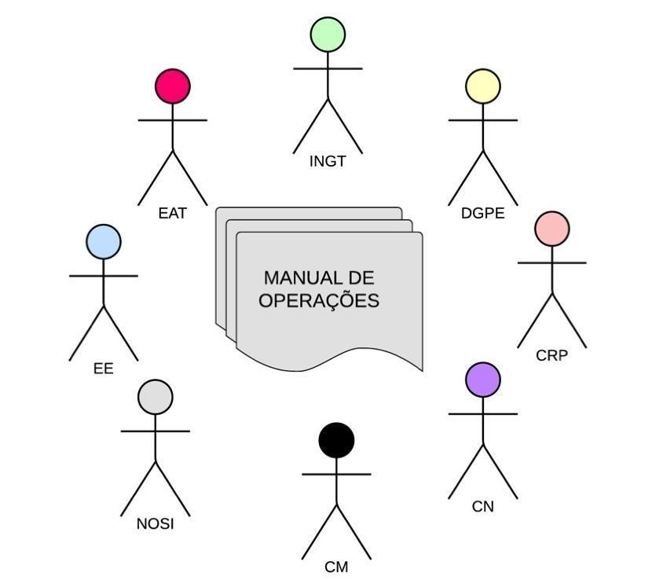

## Audiência do Manual {#audi-ncia-do-manual}

O Manual de Operações é um documento que pode ser consultado por qualquer interveniente no processo de execução do cadastro predial. Contudo tem por principais destinatários as instituições e técnicos/as que vão implementar uma operação de cadastro: sua operacionalização, implementação e fiscalização.

Figura 1- Audiência do Manual

Assim sendo, entre a audiência privilegiada do Manual de Operações, contam-se os seguintes serviços, ou mecanismos, e respetivos técnicos \(as\):

* O Instituto Nacional de Gestão do Território \(INGT\), enquanto serviço central responsável pelo Cadastro
* Ministério da Justiça, nomeadamente a Conservatória dos Registo Predial \(CRP\) e Cartórios Notariais \(CN\), e a Casa do Direito
* Ministério das Finanças, nomeadamente através da Direção Geral do Património do Estado \(DGPE\) e também dos serviços descentralizados das receitas do estado
* Câmaras Municipais \(CM\), incluindo os pelouros e serviços técnicos sociais, de urbanismo, património e finanças
* O Núcleo Operacional para a Sociedade de Informação \(NOSI\), enquanto entidade responsável pela conformidade dos sistemas informáticos com o manual
* As Equipas de Apoio Técnico \(EAT\), uma para cada área geográfica em que irá decorrer uma operação de registo sistemático, composta por técnicos/as representantes dos seguintes serviços: do Instituto Nacional de Gestão do Território \(INGT\), da Conservatória do Registo Predial territorialmente competente, do Cartório Notarial territorialmente competente, do\(s\) Município\(s\) da área abrangida pela operação, e do serviço responsável pelo património de Estado. Cabe à EAT, promover, agilizar e apoiar tecnicamente a entidade executante, incluindo na análise e aprovação da caracterização provisória, após a respectiva exposição e consulta pública
* A Entidade Executantes \(EE\) de cada operação de cadastro, enquanto entidade pública ou privada habilitada/contratada para a atividade de execução do cadastro predial numa determinada área geográfica \(pode ser o INGT directamente; ou Câmara Municipal da área territorial da Operação - mediante autorização/protocolo com o INGT, ou entidade privada contratada nos termos da lei\)

