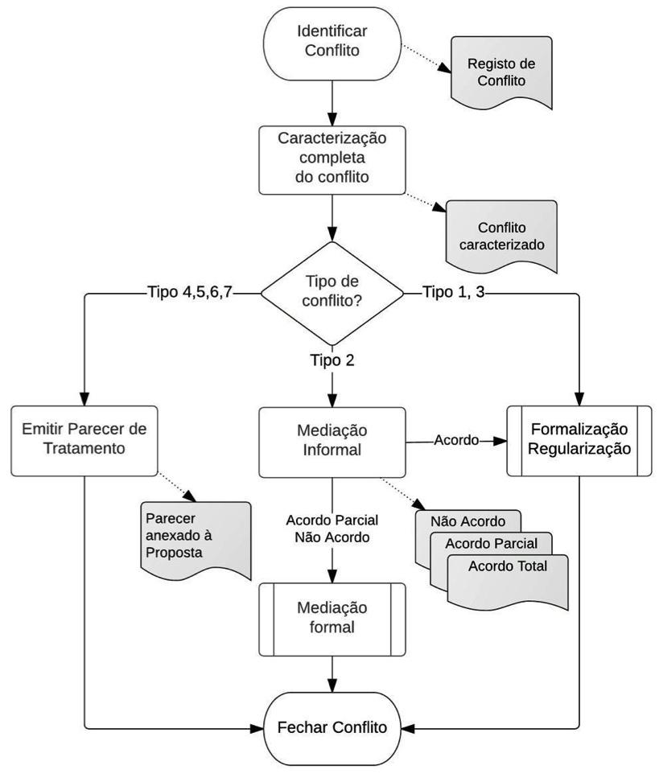

## Tratamento e Resolução de conflitos {#tratamento-e-resolu-o-de-conflitos}

### Âmbito

Durante as fases de Preparação da Operação e Aquisição de Dados Cadastrais, são identificados conflitos de vária ordem, associados a cada proposta a submeter a EAT.

O fluxo de trabalho de resolução de conflitos via acompanhar os conflitos gerados, tipificando-os e encaminhando em conformidade para a respetiva solução de tentativa de resolução.

A EE tem a tarefa de providenciar serviço de resolução informal de conflitos/disputas, através de profissionais habilitados para o efeito e com formação e/ou experiência em conflitos sobre a terra, e providenciar apoio técnico à EAT no processo de qualificação de processos.

Os procedimentos adotados pela EE para resolução do conflito registado devem obedecer aos princípios de simplicidade, adequação, informalidade e oralidade, sem prejuízo das partes podem ser assistidas por advogados ou/e peritos e fazer-se representar por mandatários e desistir em qualquer fase do processo.

Serão feitos esforços para garantir o acesso de pessoas vulneráveis a serviços de conciliação, divulgando proactivamente como aceder a estes meios, bem como serviços a montante \(tais como apoio legal e assessoria jurídica gratuita\). Para garantir o sucesso desta abordagem há que prever a formação de todo o pessoal implicado em \(i\) sensibilidade social e de género, \(ii\) especificidades do cadastro predial, \(iii\) aspetos do código civil relevantes em matéria de conjugalidade, \(iv\) disputas conjugais. Há ainda que prever o estabelecimento de parcerias institucionais, com a Casa do Direito e outras instituições que prestam apoio jurídico \(a mapear\). Por fim, devem ser estabelecidos mecanismos de seguimento do acesso efetivo das pessoas vulneráveis a estes serviços.

### Finalidade

* Proceder ao tratamento e tentativa de resolução dos conflitos associados aos prédios.

### Interveniente

* EE \(Mediador\);
* EAT;
* Titulares cadastrais/partes implicadas.

## Ferramentas

* Tipologia de conflitos;
* Caracterização jurídica do Prédio;
* Formalização de direitos;
* Qualificação de Processos.

### Diagrama

Figura 48 - Fluxograma Tratamento de conflito

Figura 49 - Fluxograma Resolução de conflitos

### Condições de partida

* O processo começou com a identificação do conflito numa das etapas da operação do cadastro.

### Sequência típica

1. Verificação da caracterização prévia e tipologia do conflito;
2. Caracterização completa do  conflito;
3. Identificação  completa  das  partes;
4. Caracterização  da  área  de  conflito e  sua  localização;
5. Menção  expressa  se  localizada  em  área  protegida;
6. Assinalar como “Prioritário”, os casos de direitos em vias de prescrição e os conflitos registados em relações de convivência duradoira, envolvendo cônjuges, unidos de factos, demais familiares e vizinhos;
7. Validar claramente a tipologia que determina o encaminhamento correto:

Tabela 9 - Tipologia de conflitos

| Tipologia de Conflitos |
| --- |
| T1. Conflitos emergentes de transmissões de prédios/posse realizados sem obediência da forma prescrita na lei. |
| T2. Conflitos quanto à titularidade de direitos entre privados |
| T3. Conflitos quanto aos limites físicos dos prédios entre privados |
| T.4. Conflitos provocados pela expropriação por utilidade pública T.4.1. Conflitos derivado de não pagamento da indemnização devida T.4.2. Conflitos derivados de não acordo quanto à fixação do valor da indemnização |
| T5. Conflitos envolvendo Estado/Municípios |
| T6. Conflitos provocados pelo recurso ilegal a justificação judicial, notarial e administrativa de prédios. |
| T7. Conflitos relativos a construções clandestinas e ilegais em terreno alheio ou zonas de risco. |

